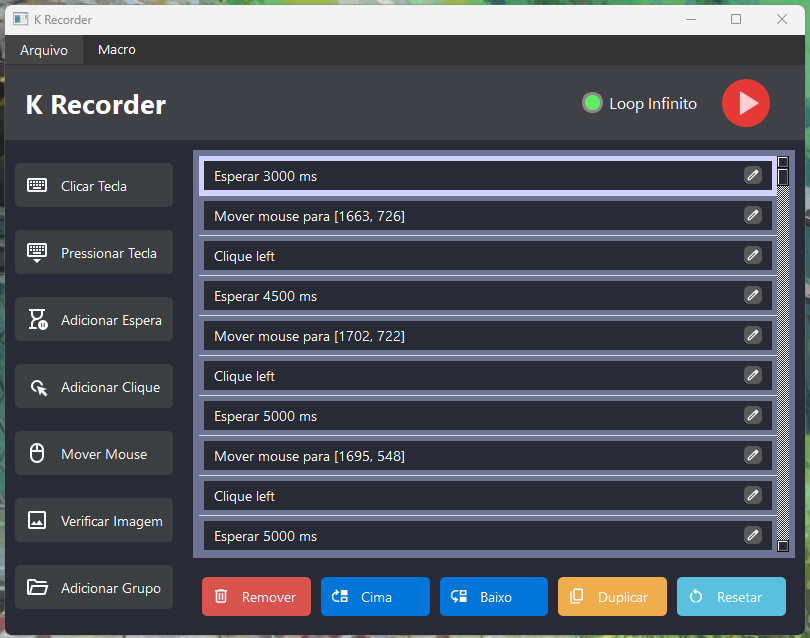

# 🎛️ K-Recorder

**K-Recorder** é uma aplicação desenvolvida em Python utilizando PySide6 que permite gravar e reproduzir macros, automatizando tarefas repetitivas no seu sistema.


## 🚀 Funcionalidades

- **Gravação de Macros**: Capture sequências de ações do teclado e mouse para automatizar tarefas.  
- **Reprodução de Macros**: Execute as macros gravadas com facilidade.  
- **Interface Intuitiva**: Desenvolvida com PySide6, proporcionando uma experiência moderna e responsiva.

## 🛠️ Tecnologias Utilizadas

A seguir estão listadas as principais tecnologias e pacotes empregados no desenvolvimento:

- **Python**

- **PySide6**  
  Para criação da interface gráfica, utilizando os módulos:  
  - `PySide6.QtCore`
  - `PySide6.QtGui`
  - `PySide6.QtWidgets`

- **Automação e Interação com a Interface**  
  - **Keyboard**: Para captura de atalhos globais e eventos de teclado.
  - **Pynput**: Para monitorar eventos do mouse.
  - **PyAutoGUI**: Para simular cliques, movimentos e outras interações com a interface.

- **Processamento de Imagens e Cálculos Numéricos**  
  - **OpenCV** (`cv2`): Para processamento e análise de imagens na tela.
  - **NumPy**: Suporte para operações numéricas e manipulação de arrays.

- **Outros Módulos da Biblioteca Padrão**  
  - `os`, `sys`: Operações do sistema e manipulação de caminhos.
  - `ctypes`: Configurações de DPI (utilizado para ajustar a visualização).
  - `json`, `time`, `threading`: Manipulação de dados, temporizações e operações assíncronas.

## 📸 Capturas de Tela

<p align="left">
  
  
</p>

## 📦 Funcionalidades

    - Gravação e execução de sequências de ações.

    - Suporte a:

        - Cliques e movimentos do mouse.

        - Pressionar e segurar teclas.

        - Combinações de teclas (Ctrl+C, Alt+Tab, etc).

        - Esperas temporizadas.

        - Verificação de imagem na tela com OpenCV.

    - Execução contínua com opção de loop.

    - Interface amigável construída com ttkbootstrap.

    - Atalhos globais:

        - F5 — Iniciar execução.

        - F6 — Parar execução.

    - Possibilidade de agrupar ações e pular grupos caso uma imagem esperada não seja encontrada.

## 🚀 Como executar o projeto

1. Clone o repositório:
```bash
git clone https://github.com/kevinlami/k-recorder.git
cd k-recorder
```
2. Instale as dependências:
```bash
pip install -r requirements.txt
```
3. Execute a aplicação:
```bash
python main.py
```

## 📷 Verificação de imagem com OpenCV
A ação image_check permite que o macro pause e verifique se uma imagem específica está presente na tela. Caso não seja encontrada, o macro pode pular a próxima ação ou grupo de ações.

## 🧑‍💻 Autor
Kevin Lami

